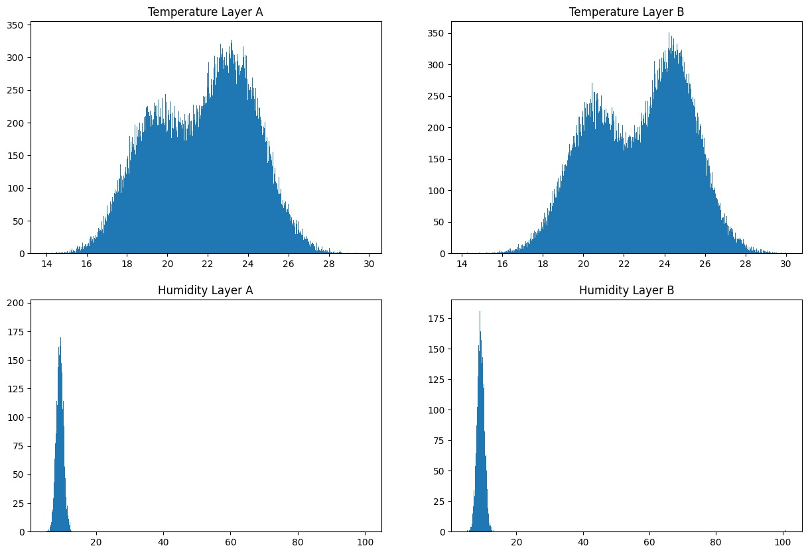
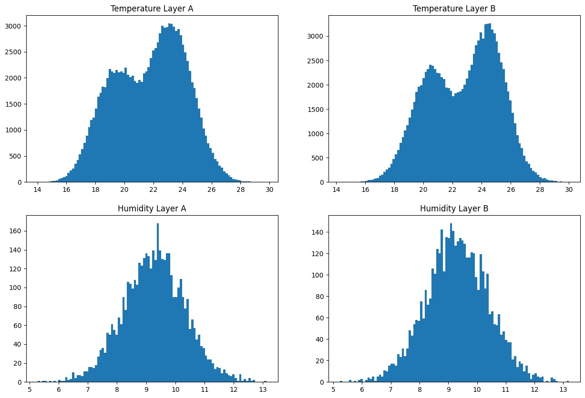

# Automatic data frame processing for AutoML

Environment for knowledge analysis - WEKA:
https://github.com/Waikato/weka

AutoML - AutoWEKA:
https://github.com/automl/autoweka

Dataset - vertical farming:
https://www.kaggle.com/datasets/midouazerty/work-for-parmavir

## Iteration 1. Manual dataset configuration, launching AutoWEKA, comparing the results.

### Data preprocessing

load the dataset and see the type of features
```python
import pandas as pd

df = pd.read_csv('../data/cubes.csv', low_memory=False)
df.dtypes
```
```
Unnamed: 0               int64
Cube ID                  int64
Timestamp                int64
Temperature Layer A     object
Temperature Layer B     object
Door                   float64
Humidity Layer A       float64
Humidity Layer B       float64
dtype: object
```

columns `Unnamed: 0` and `Door` are not interesting

```python
df = df.drop(columns=['Unnamed: 0','Door']) # exclude index and unnecessary columns
```

move `Timestamp` to `0` and cast `Temperature Layer A` and `Temperature Layer B` to float

```python
df['Timestamp'] = df['Timestamp'] - df['Timestamp'].min() # move the timer to the start

df['Temperature Layer A'] = df['Temperature Layer A'].str.replace('°C', '').astype(float)
df['Temperature Layer B'] = df['Temperature Layer B'].str.replace('°C', '').astype(float)
# cast data to type numeric

df['Humidity Layer A'] = df['Humidity Layer A']
df['Humidity Layer B'] = df['Humidity Layer B']
```

delete rows that do not contain any information

```python
df = df.dropna(how='all', subset=[
    'Temperature Layer A',
    'Temperature Layer B',
    'Humidity Layer A',
    'Humidity Layer B'
    ])
# clear data from empty rows
```

build histograms

```python
import matplotlib.pyplot as plt

plt.rcParams['figure.figsize'] = [15, 10]

bins = 100

fig, axs = plt.subplots(2, 2)

axs[0, 0].hist(df['Temperature Layer A'].values, bins=bins)
axs[0, 0].set_title('Temperature Layer A')

axs[0, 1].hist(df['Temperature Layer B'].values, bins=bins)
axs[0, 1].set_title('Temperature Layer B')

axs[1, 0].hist(df['Humidity Layer A'].values, bins=bins)
axs[1, 0].set_title('Humidity Layer A')

axs[1, 1].hist(df['Humidity Layer B'].values, bins=bins)
axs[1, 1].set_title('Humidity Layer B')

plt.show()
```



remove from dataset outliers and look at the result

```python
import numpy as np

df['Humidity Layer A'] = [x if x < 25 else np.nan for x in df['Humidity Layer A']]
df['Humidity Layer B'] = [x if x < 25 else np.nan for x in df['Humidity Layer B']]
# clear humidity from outliers
```



### Work with AutoWEKA

system: AMD Ryzen 3 2200U, 4GB RAM

version: WEKA 3.8.6, AutoWEKA 2.6.4

Take for consideration 4 feature: `Temperature layer A`, `Temperature layer B`, `Humidity layer A` and `Humidity layer B`.
For each feature apply 3 main parameters of AutoWEKA: time limit, memory limit and parallel runs,
then metrics collected such as estimated error rate, training time on evaluation dataset, correlation coefficient,
mean absolute error, root mean squared error, relative absolute error, root relative squared error. For a quantitative characteristic of performance resources, we take the number of applied configurations, for efficiency, we take the ratio


where k is the run number.


#### Temperature layer A
| N | params        | EER    | training time  | CC     | MAE    | RMSE   | RAE, %  | RRSE, % | Total of cfg | best classifier   |
| - | ------------- | ------ | -------------- | ------ | ------ | ------ | ------- | ------- | ------------ | ----------------- |
| 1 | 1m 128MB 1r   | 2.4205 |  0.671s        | 0.1256 | 2.0505 | 2.4205 | 99.2114 | 99.2085 | 11           | REPTree           |
| 2 | 5m 128MB 1r   | 2.4205 |  0.439s        | 0.1256 | 2.0505 | 2.4205 | 99.2114 | 99.2085 | 26           | REPTree           |
| 3 | 5m 256MB 1r   | 0.6152 | 29.162s        | 0.9702 | 0.3020 | 0.5140 | 10.5210 | 21.0316 | 15           | RandomForest      |
| 4 | 5m 256MB 2r   | 0.6152 | 24.949s        | 0.9702 | 0.3020 | 0.5140 | 10.5210 | 21.0316 | 22           | RandomForest      |
| 5 | 5m 512MB 2r   | 0.6152 | 24.112s        | 0.9702 | 0.3020 | 0.5140 | 10.5210 | 21.0316 | 23           | RandomForest      |
| 6 | 10m 1024MB 4r | 0.6152 | 24.112s        | 0.9702 | 0.3020 | 0.5140 | 10.5210 | 21.0316 | 39           | RandomForest      |


#### Temperature layer B
| N | params        | EER    | training time  | CC     | MAE    | RMSE   | RAE, %  | RRSE, % | Total of cfg | best classifier   |
| - | ------------- | ------ | -------------- | ------ | ------ | ------ | ------- | ------- | ------------ | ----------------- |
| 1 | 1m 128MB 1r   | 2.3970 |  1.205s        | 0.1157 | 2.0446 | 2.3970 | 99.0643 | 99.3287 | 10           | REPTree           |
| 2 | 5m 128MB 1r   | 2.3059 |  1.256s        | 0.1636 | 2.0245 | 2.3016 | 90.0070 | 98.6582 | 31           | RandomTree        |
| 3 | 10m 128MB 1r  | 2.3059 |  0.610s        | 0.1636 | 2.0245 | 2.3016 | 90.0070 | 98.6582 | 31           | RandomTree        |
| 4 | 15m 1024MB 1r | 1.2303 |  6.065s        | 0.8655 | 0.9249 | 1.2305 | 44.8119 | 50.9741 | 26           | AttributeSelected |
| 5 | 15m 2048MB 4r | 0.6338 | 42.509s        | 0.9780 | 0.3787 | 0.5095 | 10.3504 | 21.1067 | 57           | RandomForest      |


#### Humidity layer A
| N | params        | EER    | training time  | CC     | MAE    | RMSE   | RAE, %  | RRSE, % | Total of cfg | best classifier   |
| - | ------------- | ------ | -------------- | ------ | ------ | ------ | ------- | ------- | ------------ | ----------------- |
| 1 | 1m 128MB 1r   | 1.0432 | 0.125s         | 0.1585 | 0.8225 | 1.0433 | 98.3280 | 98.7357 | 20           | REPTree           |
| 2 | 1m 128MB 2r   | 1.0084 | 0.442s         | 0.2986 | 0.7964 | 1.0084 | 95.2124 | 95.4382 | 28           | AttributeSelected |
| 3 | 1m 128MB 4r   | 0.4415 | 1.094s         | 0.9193 | 0.3293 | 0.4466 | 39.3689 | 42.2700 | 27           | RandomForest      |
| 4 | 1m 256MB 4r   | 0.4415 | 0.999s         | 0.9193 | 0.3293 | 0.4466 | 39.3689 | 42.2700 | 27           | RandomForest      |
| 5 | 5m 512MB 4r   | 0.9487 | 0.313s         | 0.4402 | 0.7510 | 0.9487 | 89.7799 | 89.7898 | 91           | M5P               |
| 6 | 10m 1024MB 4r | 0.9487 | 0.651s         | 0.4402 | 0.7510 | 0.9487 | 89.7799 | 89.7898 | 108          | M5P               |
| 7 | 1m 1024MB 4r  | 0.4415 | 0.899s         | 0.9193 | 0.3293 | 0.4466 | 39.3689 | 42.2700 | 29           | RandomForest      |


#### Humidity layer B
| N | params        | EER    | training time  | CC     | MAE    | RMSE   | RAE, %  | RRSE, % | Total of cfg | best classifier   |
| - | ------------- | ------ | -------------- | ------ | ------ | ------ | ------- | ------- | ------------ | ----------------- |
| 1 | 1m 128MB 1r   | 1.0542 | 0.103s         | 0.2178 | 0.8365 | 1.0543 | 97.3863 | 97.5992 | 20           | REPTree           |
| 2 | 1m 256MB 1r   | 1.0542 | 0.063s         | 0.2178 | 0.8365 | 1.0543 | 97.3863 | 97.5992 | 20           | REPTree           |
| 3 | 1m 256MB 2r   | 0.8500 | 1.271s         | 0.6525 | 0.6646 | 0.8458 | 77.3772 | 78.2983 | 28           | Bagging           |
| 4 | 1m 512MB 2r   | 0.8500 | 1.024s         | 0.6525 | 0.6646 | 0.8458 | 77.3772 | 78.2983 | 29           | Bagging           |
| 5 | 5m 512MB 2r   | 0.8500 | 0.975s         | 0.6525 | 0.6646 | 0.8458 | 77.3772 | 78.2983 | 51           | Bagging           |
| 6 | 1m 256MB 4r   | 0.4609 | 0.765s         | 0.9186 | 0.3422 | 0.4581 | 39.8332 | 42.4091 | 28           | RandomForest      |
| 7 | 5m 512MB 4r   | 0.8500 | 2.033s         | 0.6525 | 0.6646 | 0.8458 | 77.3772 | 78.2983 | 83           | Bagging           |
| 8 | 1m 512MB 4r   | 0.4609 | 1.030s         | 0.9186 | 0.3422 | 0.4581 | 39.8332 | 42.4091 | 27           | RandomForest      |
